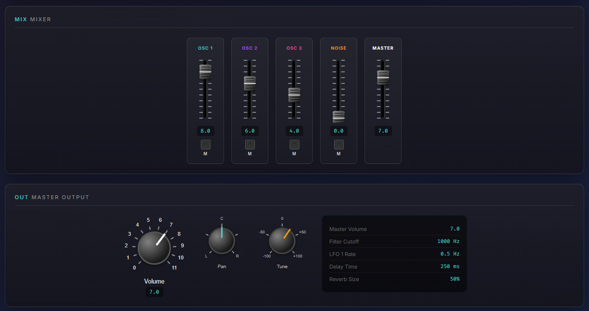

# Knobs

Rotatable knob and slider controls for audio/music web applications — like guitar amps and vintage stereos.




## Features

- **Knobs & Sliders**: Rotary knobs and vertical faders
- **Multiple Modes**: Bounded (min/max), infinite rotation, or minimum-only
- **Spinal Tap Mode**: Goes to 11!
- **Custom SVG Knobs**: Use your own artwork for unique knob designs
- **Fully Customizable**: Colors, sizes, tick marks, labels, bezels, and more
- **Value Display**: Optional real-time value readout
- **Touch Support**: Works on mobile devices
- **Modifier Keys**: Hold Shift for fast movement, Ctrl for fine adjustment
- **TypeScript**: Full type definitions included
- **Zero Dependencies**: Pure SVG rendering, no external libraries

## Installation

```bash
npm install knobs
```

## Quick Start

```html
<div id="volume-knob"></div>

<script type="module">
  import { Knob } from 'knobs';

  const knob = new Knob('#volume-knob', {
    mode: 'bounded',
    min: 0,
    max: 10,
    value: 5,
    label: 'Volume'
  });

  knob.onChange((e) => {
    console.log('Volume:', e.value);
  });
</script>
```

## Usage

### ES Modules

```javascript
import { Knob, Slider, createVolumeKnob, createFader } from 'knobs';
```

### Browser (IIFE)

```html
<script src="dist/knobs.js"></script>
<script>
  const { Knob, Slider } = Knobs;
</script>
```

## Live Examples

Run the interactive examples locally:

```bash
npm install
npm run examples
```

---

## API Reference

### Knob

```typescript
new Knob(container: HTMLElement | string, options?: KnobOptions)
```

#### Knob Options

| Option | Type | Default | Description |
|--------|------|---------|-------------|
| **Mode & Value** |
| `mode` | `'bounded'` \| `'infinite'` \| `'min-only'` | `'bounded'` | Rotation behavior |
| `value` | `number` | `0` | Initial value |
| `min` | `number` | `0` | Minimum value (bounded/min-only modes) |
| `max` | `number` | `10` | Maximum value (bounded mode) |
| `step` | `number` | `1` | Value increment |
| **Appearance** |
| `size` | `number` | `80` | Knob diameter in pixels |
| `dialColor` | `string` | `'#1a1a1a'` | Dial face color |
| `bezelColor` | `string` | `'#444444'` | Outer ring color |
| `indicatorColor` | `string` | `'#ffffff'` | Indicator line color |
| `indicatorLength` | `number` | `0.7` | Indicator length (0-1, fraction of radius) |
| `indicatorWidth` | `number` | `3` | Indicator line width in pixels |
| `gripBumps` | `boolean` | `false` | Show notched edge instead of indicator (encoder style) |
| `gripBumpCount` | `number` | `20` | Number of bumps when `gripBumps` is true |
| **Labels & Ticks** |
| `label` | `string` | `''` | Label text below knob |
| `labelColor` | `string` | `'#dddddd'` | Label text color |
| `showTicks` | `boolean` | `true` | Show tick marks around dial |
| `tickCount` | `number` | `11` | Number of tick marks |
| `tickColor` | `string` | `'#aaaaaa'` | Tick mark color |
| `showValueLabels` | `boolean` | `true` | Show value labels around dial |
| `valueLabels` | `string[]` | - | Custom labels (e.g., `['Min', '', 'Max']`) |
| **Value Display** |
| `showValueDisplay` | `boolean` | `false` | Show numeric value below knob |
| `valueDisplayColor` | `string` | `'#4ecdc4'` | Value display text color |
| **Rotation Angles** |
| `startAngle` | `number` | `-135` | Start angle in degrees (bounded mode) |
| `endAngle` | `number` | `135` | End angle in degrees (bounded mode) |
| **Sensitivity** |
| `pixelsPerFullRotation` | `number` | `400` | Pixels of drag for full rotation |
| `shiftMultiplier` | `number` | `4` | Speed multiplier when holding Shift |
| `ctrlMultiplier` | `number` | `0.25` | Speed multiplier when holding Ctrl |
| **Custom Appearance** |
| `knobSvg` | `string` | - | Custom SVG markup for the knob (see below) |
| `fontFamily` | `string` | `'Arial, sans-serif'` | Font for labels |
| `className` | `string` | - | Custom CSS class |

#### Knob Methods

| Method | Returns | Description |
|--------|---------|-------------|
| `getValue()` | `number` | Get current value |
| `setValue(value)` | `void` | Set value programmatically |
| `onChange(callback)` | `void` | Subscribe to value changes |
| `off('change', callback)` | `void` | Unsubscribe from changes |
| `getElement()` | `HTMLElement` | Get container element |
| `destroy()` | `void` | Clean up and remove |

#### Knob Change Event

```typescript
knob.onChange((event) => {
  event.value;          // New value
  event.previousValue;  // Previous value
  event.angle;          // Rotation angle in degrees
  event.knob;           // Knob instance
});
```

---

### Slider

Vertical fader control like those found on mixing consoles.

```typescript
new Slider(container: HTMLElement | string, options?: SliderOptions)
```

#### Slider Options

| Option | Type | Default | Description |
|--------|------|---------|-------------|
| **Value** |
| `value` | `number` | `0` | Initial value |
| `min` | `number` | `0` | Minimum value |
| `max` | `number` | `10` | Maximum value |
| `step` | `number` | `0.1` | Value increment |
| **Appearance** |
| `length` | `number` | `150` | Track height in pixels |
| `width` | `number` | `40` | Slider width in pixels |
| `trackColor` | `string` | `'#1a1a1a'` | Track groove color |
| `thumbColor` | `string` | `'#444444'` | Fader cap color |
| **Labels & Ticks** |
| `label` | `string` | `''` | Label text below slider |
| `labelColor` | `string` | `'#dddddd'` | Label text color |
| `showTicks` | `boolean` | `true` | Show tick marks |
| `tickCount` | `number` | `11` | Number of tick marks |
| `tickColor` | `string` | `'#aaaaaa'` | Tick mark color |
| `showValueLabels` | `boolean` | `true` | Show value labels |
| `valueLabels` | `string[]` | - | Custom labels |
| **Value Display** |
| `showValueDisplay` | `boolean` | `false` | Show numeric value |
| **Toggle Switch** |
| `showToggle` | `boolean` | `false` | Show toggle button below slider |
| `toggleState` | `boolean` | `false` | Initial toggle state |
| `toggleLabel` | `string` | `''` | Toggle button label (e.g., "Mute") |
| `toggleLedColor` | `string` | `'#00ff00'` | LED color when active |
| **Sensitivity** |
| `pixelsPerFullTravel` | `number` | - | Pixels of drag for full travel |
| `shiftMultiplier` | `number` | `4` | Speed when holding Shift |
| `ctrlMultiplier` | `number` | `0.25` | Speed when holding Ctrl |

#### Slider Methods

| Method | Returns | Description |
|--------|---------|-------------|
| `getValue()` | `number` | Get current value |
| `setValue(value)` | `void` | Set value programmatically |
| `getToggle()` | `boolean` | Get toggle state |
| `setToggle(state)` | `void` | Set toggle state |
| `onChange(callback)` | `void` | Subscribe to value changes |
| `onToggle(callback)` | `void` | Subscribe to toggle changes |
| `off(event, callback)` | `void` | Unsubscribe from events |
| `getElement()` | `HTMLElement` | Get container element |
| `destroy()` | `void` | Clean up and remove |

---

### Factory Functions

Pre-configured controls for common use cases:

#### Knobs

| Function | Description |
|----------|-------------|
| `createVolumeKnob(container, options?)` | Standard 0-10 volume knob |
| `createSpinalTapKnob(container, options?)` | Goes to 11! |
| `createPanKnob(container, options?)` | -100 to +100, centered at 0 |
| `createFrequencyKnob(container, options?)` | 20Hz to 20kHz with log labels |
| `createInfiniteKnob(container, options?)` | No bounds, rotates forever |
| `createMinOnlyKnob(container, options?)` | Has minimum, no maximum |

#### Sliders

| Function | Description |
|----------|-------------|
| `createFader(container, options?)` | Standard 0-10 fader |
| `createMuteFader(container, options?)` | Fader with mute toggle |

---

### Global Configuration

Set default sensitivity for all controls:

```typescript
import { configureKnobs } from 'knobs';

configureKnobs({
  pixelsPerFullRotation: 400,  // Default: 400
  shiftMultiplier: 4,          // Default: 4 (faster)
  ctrlMultiplier: 0.25         // Default: 0.25 (slower/finer)
});
```

---

## Examples

### Basic Volume Knob

```javascript
import { Knob } from 'knobs';

const volume = new Knob('#volume', {
  mode: 'bounded',
  min: 0,
  max: 10,
  value: 5,
  step: 0.1,
  label: 'Volume'
});

volume.onChange((e) => {
  audioContext.gainNode.gain.value = e.value / 10;
});
```

### Factory Functions

```javascript
import { createVolumeKnob, createPanKnob } from 'knobs';

const volume = createVolumeKnob('#volume', { label: 'Master' });
const pan = createPanKnob('#pan');

pan.onChange((e) => {
  // e.value ranges from -100 (full left) to +100 (full right)
  stereoPanner.pan.value = e.value / 100;
});
```

### Guitar Amp with Custom Styling

```javascript
import { createSpinalTapKnob } from 'knobs';

const ampStyle = {
  size: 70,
  dialColor: '#0a0a0a',
  bezelColor: '#333333',
  indicatorColor: '#f0f0f0',
  tickColor: '#666',
  labelColor: '#999'
};

const gain = createSpinalTapKnob('#gain', { ...ampStyle, label: 'Gain' });
const bass = createSpinalTapKnob('#bass', { ...ampStyle, label: 'Bass' });
const treble = createSpinalTapKnob('#treble', { ...ampStyle, label: 'Treble' });
const master = createSpinalTapKnob('#master', { ...ampStyle, label: 'Volume' });

// These go to 11!
```

### Infinite Rotation Encoder

```javascript
import { createInfiniteKnob } from 'knobs';

const encoder = createInfiniteKnob('#encoder', {
  label: 'Scroll',
  size: 80,
  dialColor: '#0a0a0a',
  gripBumps: true  // Notched edge for visual feedback
});

let position = 0;
encoder.onChange((e) => {
  position += e.value - e.previousValue;
  scrollToPosition(position);
});
```

### Custom SVG Knob

Use your own SVG artwork for completely custom knob designs:

```javascript
import { Knob } from 'knobs';

const pointerSvg = `<svg viewBox="0 0 100 100">
  <circle cx="50" cy="50" r="45" fill="#555"/>
  <circle cx="50" cy="50" r="38" fill="#444"/>
  <polygon points="50,8 56,38 44,38" fill="#ff6b6b"/>
</svg>`;

const knob = new Knob('#custom', {
  mode: 'bounded',
  min: 0,
  max: 10,
  value: 5,
  size: 80,
  knobSvg: pointerSvg,
  showTicks: true,
  label: 'Custom'
});
```

**Custom SVG Guidelines:**
- Include a `viewBox` attribute (e.g., `viewBox="0 0 100 100"`)
- Design centered around the middle of the viewBox
- The entire SVG rotates as a unit
- Any viewBox size works - it will be scaled to fit

### Mixer Faders

```javascript
import { Slider, createFader, createMuteFader } from 'knobs';

// Basic fader
const ch1 = createFader('#ch1', {
  label: 'CH 1',
  length: 150,
  showValueDisplay: true
});

// Fader with mute toggle
const master = createMuteFader('#master', {
  label: 'Master',
  length: 150
});

master.onChange((e) => console.log('Volume:', e.value));
master.onToggle((e) => console.log('Muted:', e.state));
```

### Value Display

Show a real-time numeric readout:

```javascript
const knob = new Knob('#filter', {
  mode: 'bounded',
  min: 20,
  max: 20000,
  value: 1000,
  label: 'Cutoff',
  showValueDisplay: true,
  valueDisplayColor: '#ff6b6b'
});
```

### Programmatic Control

```javascript
const knob = new Knob('#synth-cutoff', {
  mode: 'bounded',
  min: 0,
  max: 100,
  value: 0,
  label: 'Cutoff'
});

// Get/set value
console.log(knob.getValue()); // 0
knob.setValue(50);            // Triggers onChange

// Animate a sweep
function sweep(from, to, duration) {
  const start = performance.now();

  function animate(time) {
    const progress = Math.min((time - start) / duration, 1);
    knob.setValue(from + (to - from) * progress);

    if (progress < 1) requestAnimationFrame(animate);
  }

  requestAnimationFrame(animate);
}

sweep(0, 100, 2000); // Sweep over 2 seconds

// Clean up when done
knob.destroy();
```

---

## Interaction

| Input | Action |
|-------|--------|
| **Drag up/down** | Adjust value |
| **Shift + drag** | Fast adjustment (4x default) |
| **Ctrl + drag** | Fine adjustment (0.25x default) |
| **Touch drag** | Full touch support on mobile |

---

## TypeScript

Full type definitions are included. Import types directly:

```typescript
import {
  Knob,
  Slider,
  KnobOptions,
  SliderOptions,
  KnobChangeEvent,
  SliderChangeEvent,
  KnobMode
} from 'knobs';

const options: KnobOptions = {
  mode: 'bounded',
  min: 0,
  max: 100,
  value: 50
};

const knob = new Knob('#my-knob', options);

knob.onChange((event: KnobChangeEvent) => {
  console.log(event.value);
});
```

---

## Browser Support

Works in all modern browsers (Chrome, Firefox, Safari, Edge). Uses standard SVG and DOM APIs with no polyfills required.

---

## License

MIT
